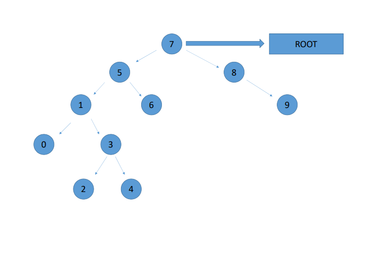

[Binary Search Tree Projesi](https://app.patika.dev/courses/veri-yapilari-ve-algoritmalar/binary-search-tree-proje)

# Proje 3

## Soru 1

#### [7, 5, 1, 8, 3, 6, 0, 9, 4, 2] dizisinin Binary-Search-Tree aşamalarını yazınız.

##### Cevap:

1. 7 root'dır. 
2. 7'nin solunda 5 bulunur.
3. 5'in solunda 1 bulunur.
4. 7'nin sağında 8 bulunur.
5. 1'in sağında 3 bulunur.
6. 5'in sağında 6 bulunur.
7. 1'in solunda 0 bulunur.
8. 8'in sağında 9 bulunur.
9. 3'ün sağında 4 bulunur.
10. 3'ün solunda 2 bulunur.

